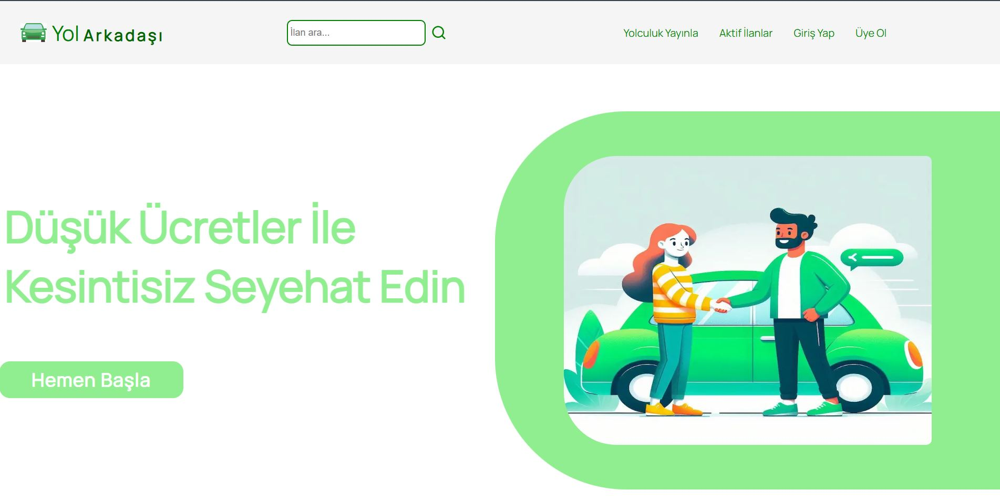
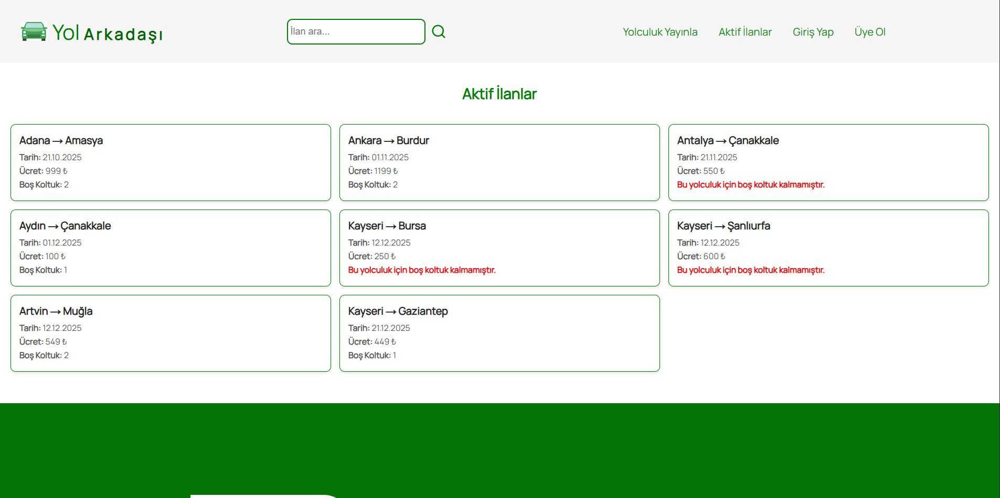
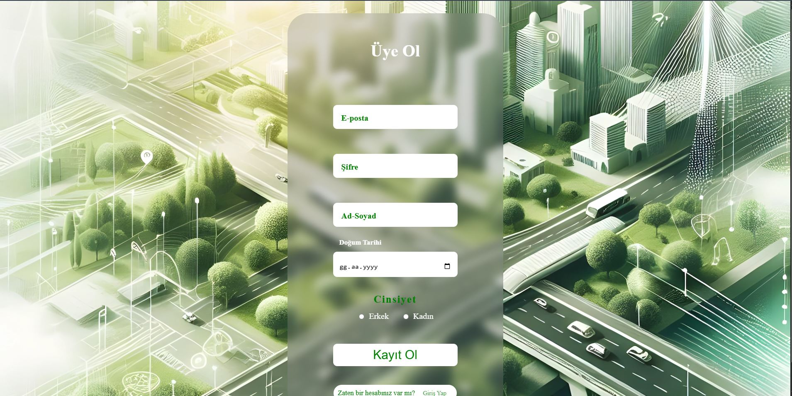
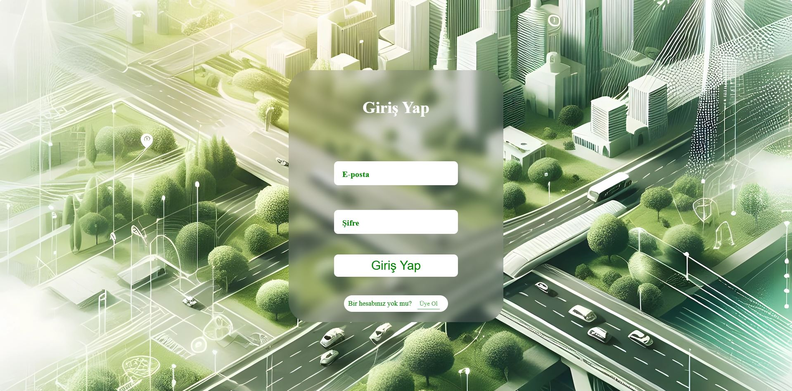
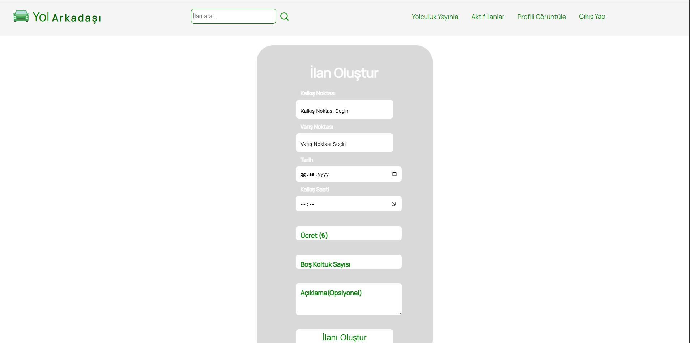
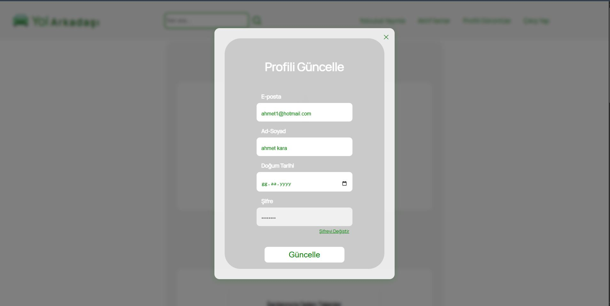
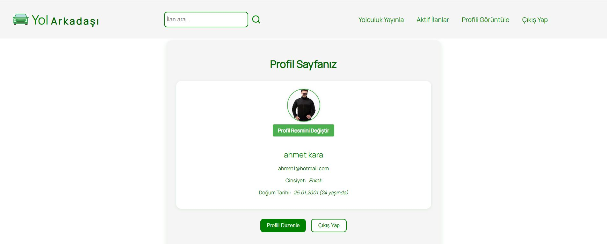
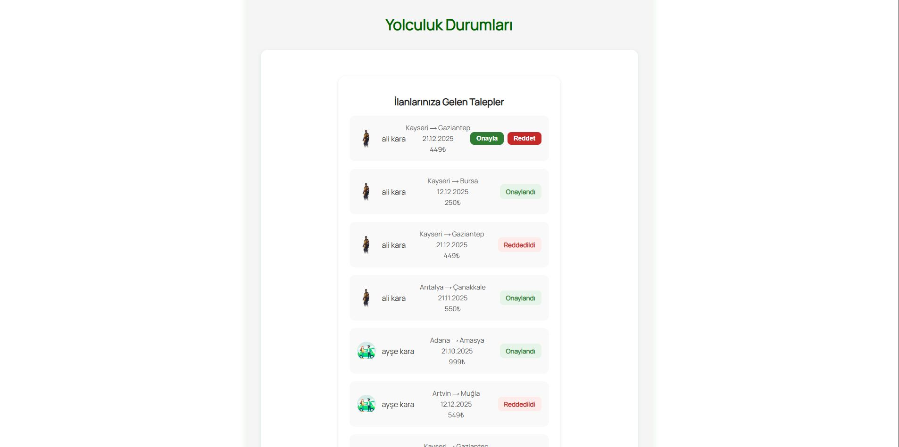

# 🚗 Web Otostop Uygulaması

> Modern ve güvenli bir otostop paylaşım platformu. Kullanıcılar yolculuk oluşturabilir, mevcut yolculuklara katılabilir ve profil yönetimi yapabilir.

---

## 📌 Proje Hakkında
Web Otostop Uygulaması, Next.js ve TypeScript kullanılarak geliştirilmiş, kullanıcıların yolculuk oluşturup paylaşabildiği, diğer kullanıcılarla iletişim kurabildiği ve güvenli bir şekilde otostop yapabildiği bir web uygulamasıdır.

---

## 🚀 Özellikler
- Kullanıcı kaydı ve kimlik doğrulama (NextAuth)
- Yolculuk oluşturma, listeleme ve katılma
- Profil düzenleme, şifre değiştirme, profil fotoğrafı yükleme
- Kapsamlı yönetim paneli (dashboard)
- Duyarlı ve modern arayüz
- Şehir seçimi ve yaş hesaplama yardımcıları
- Modal pencereler ve yükleniyor animasyonları
- Güvenli veri yönetimi ve hızlı performans

---

## 🛠️ Kullanılan Teknolojiler
- **Next.js**
- **React**
- **TypeScript**
- **CSS Modules**
- **NextAuth.js**
- **MongoDB**
- **Cloudinary** (Profil fotoğrafları için)

---

## 📂 Proje Dizini
```
├── src/app/           # Sayfalar ve layout dosyaları
├── src/components/    # Tekrar kullanılabilir arayüz bileşenleri
├── src/features/      # State yönetimi ve özel hooklar
├── src/lib/           # Yardımcı fonksiyonlar ve API işlemleri
├── src/models/        # Mongoose modelleri
├── src/providers/     # Context sağlayıcıları
├── src/types/         # TypeScript tip tanımları
├── public/            # Statik dosyalar ve görseller
```

---

## ⚡ Kurulum ve Başlangıç

### Gereksinimler
- Node.js >= 18.x
- npm veya yarn
- MongoDB veritabanı
- Cloudinary hesabı (profil fotoğrafları için)

### Kurulum Adımları
1. **Projeyi klonlayın:**
   ```powershell
   git clone https://github.com/HicabiKara/otostop-uygulamasi.git
   cd otostop-uygulamasi
   ```
2. **Bağımlılıkları yükleyin:**
   ```powershell
   npm install
   # veya
   yarn install
   ```
3. **Ortam değişkenlerini ayarlayın:**
   Proje kök dizininde `.env.local` dosyası oluşturun ve aşağıdaki değişkenleri ekleyin:
   ```env
   MONGODB_URI=MongoDB bağlantı adresiniz
   CLOUDINARY_URL=Cloudinary url adresiniz
   NEXTAUTH_SECRET=NextAuth gizli anahtarınız
   NEXTAUTH_URL=http://localhost:3000
   ```
4. **Geliştirme sunucusunu başlatın:**
   ```powershell
   npm run dev
   # veya
   yarn dev
   ```
5. **Uygulamayı açın:**
   [http://localhost:3000](http://localhost:3000)

---

## 🖼️ Ekran Görüntüleri
Kullanıcı dostu arayüz, profil yönetimi ve yolculuk kartları ile modern bir deneyim sunar.










---

## 🤝 Katkıda Bulunma
Katkılarınızı bekliyoruz! Hataları bildirebilir veya yeni özellikler eklemek için pull request gönderebilirsiniz.

1. Fork alın
2. Yeni bir branch oluşturun
3. Değişiklikleri yapın ve commitleyin
4. Pull request gönderin

---

## 📄 Lisans
Bu proje MIT lisansı ile lisanslanmıştır.

---

## 📬 İletişim
Sorularınız veya önerileriniz için [GitHub Issues](https://github.com/HicabiKara/otostop-uygulamasi/issues) üzerinden iletişime geçebilirsiniz.

---

> **Web Otostop Uygulaması** ile güvenli ve kolay yolculuk paylaşımının keyfini çıkarın!
